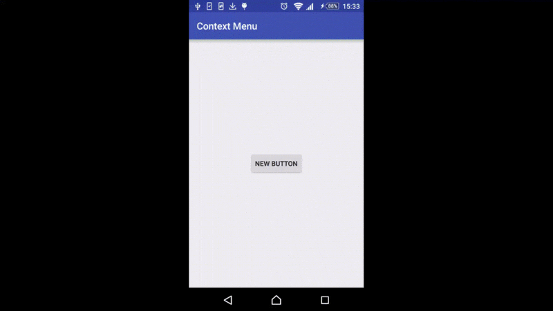

1. Context Menu
==================
Demo:



`Context Menu` is a floating menu when use click on a view it is clipped.
Just like new `Text Selection` floating toolbar in Android MarshMallow.
It can show up with custom direction you want.

2. Gradle Dependency
==================

### Repository

```Gradle
maven { url 'https://dl.bintray.com/ryandam/maven/' }
```

### Dependency

```Gradle
dependencies {
    compile 'com.rstudio.widget:contextmenu:0.1'
}
```

3. Usage
==================

Declare a new `Context Menu`:

```java
ContextMenu menu = new ContextMenu.Builder(context)
        .setContextMenuView(R.layout.context_menu)
        .build();
```

Custom action for component in `Context Menu`, you have to do this before clip `Context Menu` to view
or you'll get problem :D

```java
ImageButton delContextBt = (ImageButton) menu.getView().findViewById(R.id.context_del);
delContextBt.setOnClickListener(new View.OnClickListener() {
            @Override
            public void onClick(View v) {
                mCallback.delete(card.getID());
                menu.dismiss();
            }
        });
```

Clip `Context Menu` to a view:

```java
menu.clipToView(desView);
```

### Dismiss `Context Menu`

```java
.dismiss()
```

### Custom direction

Default direction is LEFT. You can change it:

```java
.setDirection(ContextMenu.Direction.RIGHT);
```

### Custom dim background alpha

```java
.setWindowBacgroundAlpha(0.2f);
```

### Custom view padding

Custom margin from `Context Menu` to clipped view

```java
.setViewPadding(10);
```

### Custom animation when `Context Menu` show up

This method must be called when `Context Menu` is building

```java
.setCustomWindowAnimations(R.anim.custom);
```